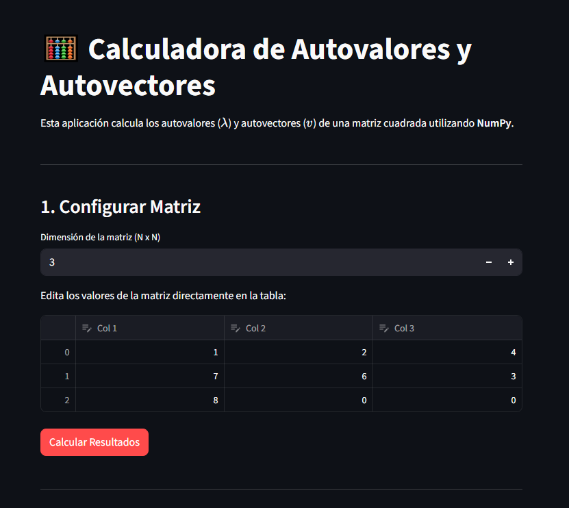

# Calculadora de Autovalores

Una aplicación web interactiva construida con **Python** y **Streamlit** que permite calcular de manera rápida y sencilla los autovalores ($\lambda$) y autovectores ($v$) de cualquier matriz cuadrada. 

 

## Estructura del proyecto

- `calculadora_autovalores.py`: código principal de la app.
- `requirements.txt`: dependencias para instalar en el entorno virtual.
- `README.md`: este documento.
- `.gitignore`: archivos y carpetas que no deben subirse.

## ✨ Características Principales

* **Interfaz Intuitiva:** Ingresa los datos de la matriz directamente en una tabla tipo hoja de cálculo (gracias a `st.data_editor`).
* **Dimensión Dinámica:** Ajusta el tamaño de la matriz (desde 2x2 hasta 10x10) con un solo clic.
* **Precisión Matemática:** Cálculos robustos en el backend utilizando `numpy`.
* **Soporte para Números Complejos:** Identifica automáticamente si la matriz contiene rotaciones (autovalores imaginarios).

## 🛠️ Tecnologías Utilizadas

* **[Python](https://www.python.org/):** Lenguaje principal.
* **[Streamlit](https://streamlit.io/):** Para la creación rápida de la interfaz gráfica web.
* **[NumPy](https://numpy.org/):** Para el motor de cálculo de álgebra lineal.
* **[Pandas](https://pandas.pydata.org/):** Para la manipulación y renderizado de la tabla de datos.

### 1. Clonar el repositorio
```bash
git clone [https://github.com/Byirosaleshd/Calculator-autovalues](https://github.com/Byirosaleshd/Calculator-autovalues.git)
```

## Uso local

1. Crea y activa un entorno virtual:
   ```bash
   python -m venv .venv
   .\.venv\Scripts\activate  # Windows (PowerShell)
   # o source .venv/bin/activate en macOS/Linux
   ```
2. Instala dependencias:
   ```bash
   pip install -r requirements.txt
   ```
3. Ejecuta la aplicación:
   ```bash
   streamlit run calculadora_autovalores.py
   ```

La app estará disponible en `http://localhost:8501`.

## Despliegue en la nube.

- Esta desplegado en la nube en: `https://calculator-autovalues.streamlit.app/`
- Asegúrate de tener `requirements.txt` en la raíz y que el archivo principal se llame `calculadora_autovalores.py`.
